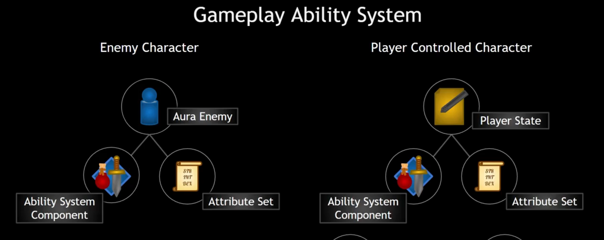

# Aura Note

## 1.1项目介绍

这篇笔记用来记录下从零开始开发一个自顶向下的RPG游戏。

在课程介绍中了解到这个项目

* 具有完备的游戏功能，有技能，经验值，属性，升级等系统。
* 还有AI驱动的敌人
* 基本输入和增强输入系统
* 编码性和可扩展性强。

## 2.1创建项目

课程会有一个配套的项目，下载好后解压出来。

双击.uproject文件在UE中打开项目，接下来进行自定义配置。

课程老师使用的IDE是Jet Brain的Rider，需要在Editor Preference中搜索Source Code Editor设置为Rider Uproject。搜索Live禁用Live Coding，搜索Automatically Compile New C++ Class禁用。在插件中启用Rider Integration。设置MainWindow

在Project Setting中设置Legal中的Copyright Notice

## 2.2设置版本控制

在github上新建一个仓库，命名为GAS_Aura

```
添加README.md文件
添加gitignore文件
```

```
# gitignore
Binaries
DerivedDataCache
Intermediate
Saved
Build

.vscode
.Vs
*.vc.db
.opensdf
.opendb
*.sdf
*.sln
*.suo
*.xcodeproj
*.xcworkspace
```

## 2.3基础角色类（AuraCharacterBase）

在UE中新增一个角色类（Character），将其放在Public文件夹中，并命名为AuraCharacterBase。由于关闭了自动编译C++类，在创建完成后，需关闭UE，在项目根目录中右键.uproject文件，选择使用Jet Brains Rider打开。

由于课程中要进行大量的调试练习，项目会在调试状态下运行，我们需要安装引擎用来调试的编辑器符号。但是不一定必须这样做，因为占用的内存太大了。

## 2.4玩家角色和敌人角色类（AuraCharacter和AuraEnemy）

在UCLASS宏中添加Abstract抽象说明符可使类成为抽象类，则该类不能直接被拖进关卡中。

**基础角色类**中不需要**设置移动输入**和**实时更新**，删除即可，并且在构造函数中将是否实时更新设置为**false**。

我们希望有一个合理的目录结构，我们要把**AuraCharacterBase**类放入Character文件夹中
**Rider**中只需要在Public和Private中分别新建目录**Characters**，再将**AuraCharacterBase**的头/源文件分别复制进去即可。
**VS**中除了上述操作外，还需要先关掉IDE，删除二进制和中间文件，再重新生成即可。

更改完成后需要修改包含头文件的代码

接着启动UE，从**AuraCharacterBase**中新建继承它的两个类**AuraCharacter**和**AuraEnemy**。

## 2.5设置角色蓝图

每个角色都会用到武器，我们还需要将武器附着到骨骼插槽上。

我们要在角色类中定义骨骼网格体组件指针，在**AuraCharacterBase**中新增TObjectPtr<USkeletalMeshComponent>类型变量，其中不要加星号，但是变量仍是指针，命名为Weapon。
TObjectPtr类型是T对象指针包装器，在打包构建中，和原始指针的行为一致，但是在编辑器中，它有访问跟踪和可选的延迟加载功能

* 访问跟踪是指我们指针访问和解引用的频率次数。
* 延迟使用是在程序需要或使用前才加载资产。

我们需要给这个变量设置**UPROPERTY**，在任意地方编辑和设置类别为**Combat**

然后在**AuraCharacterBase**的构造函数中实例化Weapon变量

```
Weapon = CreateDefaultSubObject<USkletalMeshComponent>("Weapon");
Weapon->SetAttachment(GetMesh,"WeaponHandSocket");
Weapon->SetCollision(NoCollision);
```

打开UE，添加玩家角色的蓝图类，设置好WeaponHandSocket的位置，将武器设置为骨骼网格体-法杖。

接着自行制作Goblin敌人类


## 2.6动画蓝图类

在蓝图类的角色文件夹中新建AnimInstance类，命名为AuraCharacter。

打开动画蓝图类，新建一个状态机，状态机后连接一个Slot用于播放动画蒙太奇。

在状态机中添加节点IdleWalkRun，节点动画设置为混合空间动画IdleWalkRun。
在蓝图中获取变量AuraCharacter，CharacterMovement，并在update中获取CharacterMovement中的速度GroundSpeed即可使用IdleWalkRun

敌人动画类将是一个动画模板，添加一个动画模板（暂时先不用选择骨架），作同AuraCharacter的操作，在混合空间一步时，右键添加BlendSpacePlayer，最后将GroundSpeed连接至X即可。

新建动画蓝图，选择模板和骨骼，在资产覆盖（Anim Graph Overrides）中将BlendSpacePlayer设置为对应网格体的动画。

接下来自行制作哥布林弹弓手的敌人类和敌人动画类。


## 2.7增强输入

在BluePrints文件夹中新建Input/InputActions文件夹

右键新增类Input Action命名为IA_Move，

双击打开IA_Move，将ValueType设置成处理二维移动Axis2D（Vector2D）

3D空间一般将角色的前向向量看作是X轴，但是在二维中，前后是WS，是y轴。

接下来通过输入上下文映射将输入和角色连接起来。

新建Input Mapping Context类，命名为IMC_AuraContext，添加Mapping设置值为IA_Move，再设置向右移动按键D，按键D是向右移动在x轴上输入正值数据，而向左移动A键输出负值，在按键的modify中设置Index[0]为Negate，我们把移动视为x轴，由此我们只需要选中x轴，即是否定x轴，输出负值，取消勾选y和z。前后WS需要在modify中添加转换Swizzle Input Axis Values。下拉菜单中的Order中的值为YXZ，即输入会先入Y轴。

接下来需要新建一个玩家控制器类到Player文件夹中，命名为AuraPlayController。

## 2.8Aura玩家控制器

在**玩家控制器**添加**构造函数**和BeginPlay()，在控制器中，我们想要确保这个控制器能够被复制，需要在控制器的构造函数中将设置bReplicate=true。复制就是在多人游戏服务器中某个实体发生变化的时候，其他客户端能够接收到这个变化。

我们要在玩家控制器中添加TObjectPtr<UInputMappingContext>类型的变量。

```
UPROPERTY(EditAnywhere,Catgory="Input")
TObjectPtr<UInputMappingContext> AuraContext;
```

还需要再Aura.build.cs中添加Enhanced Input包引用。

再在BeginPlay函数中添加如下代码

```
void AAuraPlayerController: :BeginPlay()
{
	Super::BeginPlay();
	//如果AuraContext，任何输入都无响应，问题很严重，需要停止运行
	check(AuraContext);
	
	//访问增强输入的本地玩家的子系统，本地指针子系统，子系统是单例模式，运行期间只能存在一个
	UEnhancedInputLocalPlayerSubsystem* Subsystem = ULocalPlayer::GetSubsystem<UEnhancedInputLocalPlayerSubsystem>(GetLocalPlayer());
	check(Subsystem);
	//添加Aura输入映射，设置优先级为0
	Subsystem->AddMappingContext(AuraContext, 0);

	//显示鼠标
	bShowMouseCursor = true;
	//将显示的鼠标设置为默认鼠标
	DefaultMouseCursor = EMouseCursor::Default;
	
	//设置输入方式，使用键盘输入
	FInputModeGameAndUI InputModeData;
	//设置鼠标不会绑定在窗口内
	InputModeData.SetLockMouseToViewportBehavior(EMouseLockMode::DoNotLock);
	//设置在视口内的鼠标不会被隐藏
	InputModeData.SetHideCursorDuringCapture(false);
	//传入数据设置光标
	SetInputMode(InputModeData);
}
```

## 2.9移动输入

```
// 定义 AuraPlayerController 类的 SetupInputComponent 方法，用于设置输入组件
void AAuraPlayerController::SetupInputComponent()
{
    // 调用父类的 SetupInputComponent 方法，确保父类的输入设置也被执行
    Super::SetupInputComponent();

    // 将 InputComponent 转换为 UEnhancedInputComponent 类型，并进行检查（确保转换成功）
    UEnhancedInputComponent* EnhancedInputComponent = CastChecked<UEnhancedInputComponent>(InputComponent);

    // 绑定动作 MoveAction 到当前控制器的 Move 方法，当动作被触发时执行 Move 方法
    EnhancedInputComponent->BindAction(MoveAction, ETriggerEvent::Triggered, this, &AAuraPlayerController::Move);
}

// 定义 AuraPlayerController 类的 Move 方法，处理移动输入
void AAuraPlayerController::Move(const FInputActionValue& InputActionValue)
{
    // 从输入动作值中获取 2D 向量输入（通常来自游戏手柄或键盘的移动输入）
    const FVector2D InputAxisVector = InputActionValue.Get<FVector2D>();
    // 获取控制器的旋转（用于确定移动方向）
    const FRotator Rotation = GetControlRotation();
    // 创建仅包含 Yaw（偏航）的旋转（忽略 Pitch 和 Roll）
    const FRotator YawRotation(0.f, Rotation.Yaw, 0.f);

    // 将 Yaw 旋转转换为旋转矩阵，并获取其 X 轴单位向量（前向方向）
    const FVector ForwardDirection = FRotationMatrix(YawRotation).GetUnitAxis(EAxis::X);
    // 将 Yaw 旋转转换为旋转矩阵，并获取其 Y 轴单位向量（右向方向）
    const FVector RightDirection = FRotationMatrix(YawRotation).GetUnitAxis(EAxis::Y);

    // 获取当前控制的 Pawn（玩家角色）
    if (APawn* ControlledPawn = GetPawn<APawn>())
    {
        // 基于前向方向和输入向量的 Y 分量（通常对应前后移动）添加移动输入
        ControlledPawn->AddMovementInput(ForwardDirection, InputAxisVector.Y);
        // 基于右向方向和输入向量的 X 分量（通常对应左右移动）添加移动输入
        ControlledPawn->AddMovementInput(RightDirection, InputAxisVector.X);
    }
}
```

在UE新建蓝图类继承自AuraPlayController，命名为BP_AuraPlayerController，打开并设置AuraContext和MoveAction

## 2.10游戏模式

新建一个继承自GameModeBase的C++类，放在Game文件夹下，命名为AuraGameModeBase。

## 2.11敌人接口（Enemy Interface）


当我们点击场景中某个物体时，会在场景中选择高亮该物体。由此我们希望设计一个接口，来使场景中的每一个物体在被点击时出现不同的效果。

**实现如下：**

新建一个Interface类，命名为EnemyInterface。在类中创建纯虚函数WighlightActor()和UnwighlightActor()，使之称为抽象类。随后使得Enemy类继承EnemyInterface类，并重写EnemyInterface类函数，否则会编译失败。

## **3.1Gameplay Ability System（GAS）**

游戏能力系统是什么？我们如何在游戏项目中使用它？

UEdoc：游戏能力系统是一个超级灵活的框架，用来构建你可能在RPG或MOBA游戏中找到的各种能力和属性。

## **3.2GAS的主要组成部分**


能力系统组件（Ability System Component）

属性集合（Attribute Set）

游戏能力（Gameplay Ability）

能力任务（Ability Task）

游戏影响（Gameplay Effect）

（Gameplay Cue）

（Gameplay Tag）

组件的添加方式


两种不同选择的使用


在本项目中，采用以下方式，将能力系统组件直接放在敌人身上。而对于玩家，则放在玩家状态上



## **3.3玩家状态（The Play State）**

新建一个PlayState类命名为AuraPlayState，在其构造函数中添加以下代码

```c++
//服务器尝试更新客户端的频率
NetUpdateFrequency = 100.f;
```

创建以AuraPlayState为父类的BP_AuraPlayState蓝图类，并设置游戏中的PlayState类为BP_AuraPlayState。

## **3.4能力系统组件**

在Unreal Engine中启用插件Gameplay Ability。

创建一个AbilitySystemComponent类命名为AuraAbilitySystemComponent，再创建一个AttributeSet类命名为AuraAttributeSet。

之后再在.Build.cs文件中添加GameplayAbilities，GameplayTags，GameplayTask，三个privateDependcy模块

## **3.5多人游戏GAS**


## **3.6结构化ASC（Ability System Component）和AS（Ability Set）**

将ASC和AS添加到需要它们的类中。

首先打开AuraCharacterBase类，在其中添加ASC和AS。在子类构造函数中进行实例化

```c++
AbilitySystemComponent = CreateDefaultSubobject<UAuraAbilitySystemComponent>("AbilitySystemComponent");
AbilitySystemComponent->SetIsReplicated( ShouldReplicate: true);

AttributeSet = CreateDefaultSubobject<UAuraAttributeSet>("AttributeSet");
```

在玩家状态类（AuraPlayState）中实例化ASC和AS。

最后，还需要在AuraCharacterBase和AuraPlayState类中添加接口IAbilitySystemInterface。其中含有纯虚函数GetAbilitySystemComponent（）。

需要在AuraCharacter和AuraPlayState类中重写该函数并新增GetAttributeSet函数。

## **3.7Replication Mode**

在AbilitySystemComponent调用函数SetIsReplicated()之后，还需要调用函数SetReplicationMode()，该函数的参数内容为以下三个。


为多人游戏编程一个项目，它照样能在单人模式下运行，反之则不行，所以在游戏设计之初便设计好。

在PlayerState中设置为Full，而在AuraEnemy中则设置为Minmal

## **3.8初始化能力物体信息**

ASC的拥有者（Owner）和化身（Avatar）可能不是同一个AActor。在AuraEnemy中，Owner和Avatar是同一个AActor，但是在AuraCharacter中，ASC的Owner是AuraPlayState，Avatar是AuraCharacter。

于是需要我们来设置Owner和Avatar


PossessedBy()函数是给服务器使用的。客户端使用AcknowledgePossession()或OnRep_PlayerState()。

在AuraCharacter类中的PossessedBy和OnRep_PlayerState()函数中分别加入以下代码，或者将以下代码封装为一个函数，再分别调用即可。

```
AAuraPlayerState* AuraPlayerState = GetPlayerState<AAuraPlayerState>();
check(AuraPlayerState);
AuraPlayerState->GetAbilitySystemComponent()->InitAbilityActorInfo(InOwnerActor.AuraPlayerState, InAvatarActor.this);
AbilitySystemComponent = AuraPlayerState->GetAbilitySystemComponent();
AttributeSet = AuraPlayerState->GetAttributeSet();
```

```
Mixed Replication Mode

For Mixed Replication Mode: The OwnerActor's Owner must be the Controller. For Pawns, this
is set automatically in PossessedBy ().
The PlayerState's Owner is automatically set to the Controller.
Therefore, if your OwnerActor is not the PlayerState, and you use Mixed Replication Mode,
you must call SetOwner () on the OwnerActor to set its owner to the Controller.
```

如果设置为Mixed Replication Mode，

## **4.1Attribute**


一个继承自AttributeSet的类可以存放所有Attribute，也可以将它们分开存放。

无预测情况下，客户端在造成重要游戏效果时不会立即变化客户端的属性，而是将请求发送给服务器，再等待服务器回复，服务器觉得有效才返回允许，客户端才会修改属性值。

在有预测情况下，客户端会立即变化属性值，再将请求发送给服务器，若服务器认为该行为存在问题，则会发送数据撤销之前的改动。

## **4.2生命值和魔法值**

首先在UAuraAttributeSet类中需要声明变量，让它能够被复制，然后创建一个能接收旧值的更新通知，再定义这个通知。

```
UPROPERTY(BlueprintReadOnly, ReplicatedUsing = OnRep_Health, Category = "Vital Attributes")
FGameplayAttributeData Health;
```

再在通知中加上更新宏，是为了通知能力系统有变化，这样Ability System Component就能知道值发生变化了。

```
void UAuraAttributeSet::OnRep_Health(const FGameplayAttributeData& OldHealth) const
{
	GAMEPLAYATTRIBUTE_REPNOTIFY(UAuraAttributeSet, Health, OldHealth);
}
```

然后把这个可复制变量加到获取生命周期复制的属性里，条件设为无，更新通知设为总是

```
void UAuraAttributeSet::GetLifetimeReplicatedProps(TArray<FLifetimeProperty>& OutLifetimeProps) const
{

	Super: : GetLifetimeReplicatedProps( [&] OutLifetimeProps);
	//注册健康能被复制，这对于任何东西想要被复制都是必须的
	DOREPLIFETIME_CONDITION_NOTIFY(UAuraAttributeSet, Health, COND_None, REPNOTIFY_Always);

}
```

## **4.3**

使用下列宏可以为Health生成Getter代码。

```
GAMEPLAYATTRIBUTE_PROPERTY_GETTER(UAuraAttributeSet, Health);
```

首先定义如下

```
#define ATTRIBUTE_ACCESSORS(ClassName, PropertyName) \
GAMEPLAYATTRIBUTE_PROPERTY_GETTER(ClassName, PropertyName) \
GAMEPLAYATTRIBUTE_VALUE_GETTER(PropertyName) \
GAMEPLAYATTRIBUTE_VALUE_SETTER(PropertyName) \
GAMEPLAYATTRIBUTE_VALUE_INITTER(PropertyName)
```

则使用

```
ATTRIBUTE_ACCESSORS(UAuraAttributeSet, Health);
```

可以生成初始化、设置和获取函数。

构造函数中初始化时间较早，后续给出更加合理的方案。

## **4.4Effect Actor**

再虚幻编辑器中新建Actor类，命名为AuraEffect，只需设置重叠函数，不需要每帧都更新，需要在构造函数声明重叠球体并在BeginPlay()中添加委托。

```
Sphere->OnComponentBeginOverlap.AddDynamic(this, &AAuraEffectActor :: OnOverlap);
```

```
void AAuraEffectActor::OnOverlap(UPrimitiveComponent* OverlappedComponent, AActor* OtherActor,
UPrimitiveComponent* OtherComp, int32 OtherBodyIndex, bool bFromSweep, const FHitResult& SweepResult)
{
    //TODO: Change this to apply a Gameplay Effect. For now, using const_cast as a hack!
    if (IAbilitySystemInterface* ASCInterface = Cast<IAbilitySystemInterface>(OtherActor))
	{
        //AttributeSet为const类型，需要通过游戏效果进行改变。
        const UAuraAttributeSet* AuraAttributeSet = Cast<UAuraAttributeSet>( SrcASCInterface->GetAbilitySystemComponent()->GetAttributeSet(UAuraAttributeSet::StaticClass()));
        //将AttributeSet转换成非const类型，为了能够直接更改。
        UAuraAttributeSet* MutableAuraAttributeSet = const_cast<UAuraAttributeSet*>(AuraAttributeSet);
        MutableAuraAttributeSet->SetHealth( NewVal:AuraAttributeSet->GetHealth() + 25.f);
        Destroy();
	}
}
```

## **5.1Game UI Architecture**

使用MVC模式进行游戏开发

## **5.2Aura User Widgets and Widgets Controller**

在编辑器中新建一个名字为UserWidget的C++类，命名为AuraUserWidget，再新建一个Object类命名为AuraControllerWidget。