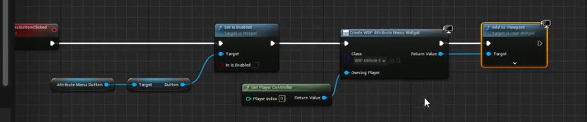

# Aura Note

## 目录

### 1.Introduction

1个讲座·12分钟

### 2.Project Creation

14个讲座·2小时26分钟

### 3.Intro to the Gameplay Ability System

8个讲座·1小时23分钟

### 4.Attributes

4个讲座·1小时1分钟

### 5.RPG Game UI

9个讲座·2小时27分钟

### 6.Gameplay Effects

12个讲座·3小时31分钟

### 7.Gameplay Tags

16个讲座·3小时23分钟

### 8.RPG Attributes

11个讲座·2小时48分钟

### 9.Attribute Menu

21个讲座·4小时42分钟

### Gameplay Abilities

15个讲座·3小时56分钟

### Ability Tasks

15个讲座·3小时53分钟

### RPG Character Classes

5个讲座·1小时11分钟

### Damage

17个讲座·4小时32分钟

### Advanced Damage Techniques

14个讲座·4小时16分钟

### Enemy Al

14个讲座·2小时33分钟

### Enemy Melee Attacks

13个讲座·3小时8分钟

### Enemy Ranged Attacks

9个讲座·1小时15分钟

### Enemy Spell Attacks

5个讲座·38分钟

### Enemy Finishing Touches

26个讲座·4小时33分钟

### Level Tweaks

5个讲座·1小时54分钟

### Cost and Cooldown

14个讲座·3小时48分钟

### Experience and Leveling Up

15个讲座·3小时54分钟

### Attribute Points

6个讲座·1小时15分钟

### Spell Menu

33个讲座·9小时33分钟

### Combat Tricks

13个讲座·4小时4分钟

### What a Shock

22个讲座·6小时43分钟

### Passive Spells

7个讲座·1小时44分钟

### Arcane Shards

18个讲座·4小时39分钟

### Fire Blast

9个讲座·1小时59分钟

### Saving Progress

23个讲座·5小时45分钟

### Checkpoints

15个讲座·3小时42分钟

### Map Entrance

17个讲座·4小时53分钟

### Course Conclusion

2个讲座·8分钟

## 1.1项目介绍

这篇笔记用来记录下从零开始开发一个自顶向下的RPG游戏。

在课程介绍中了解到这个项目

* 具有完备的游戏功能，有技能，经验值，属性，升级等系统。
* 还有AI驱动的敌人
* 基本输入和增强输入系统
* 编码性和可扩展性强。

## 2.1创建项目

课程会有一个配套的项目，下载好后解压出来。

双击.uproject文件在UE中打开项目，接下来进行自定义配置。

课程老师使用的IDE是Jet Brain的Rider，需要在Editor Preference中搜索Source Code Editor设置为Rider Uproject。搜索Live禁用Live Coding，搜索Automatically Compile New C++ Class禁用。在插件中启用Rider Integration。设置MainWindow

在Project Setting中设置Legal中的Copyright Notice

## 2.2设置版本控制

在github上新建一个仓库，命名为GAS_Aura

```
添加README.md文件
添加gitignore文件
```

```
# gitignore
Binaries
DerivedDataCache
Intermediate
Saved
Build

.vscode
.Vs
*.vc.db
.opensdf
.opendb
*.sdf
*.sln
*.suo
*.xcodeproj
*.xcworkspace
```

## 2.3基础角色类（AuraCharacterBase）

在UE中新增一个角色类（Character），将其放在Public文件夹中，并命名为AuraCharacterBase。由于关闭了自动编译C++类，在创建完成后，需关闭UE，在项目根目录中右键.uproject文件，选择使用Jet Brains Rider打开。

由于课程中要进行大量的调试练习，项目会在调试状态下运行，我们需要安装引擎用来调试的编辑器符号。但是不一定必须这样做，因为占用的内存太大了。

## 2.4玩家角色和敌人角色类（AuraCharacter和AuraEnemy）

在UCLASS宏中添加Abstract抽象说明符可使类成为抽象类，则该类不能直接被拖进关卡中。

**基础角色类**中不需要**设置移动输入**和**实时更新**，删除即可，并且在构造函数中将是否实时更新设置为**false**。

我们希望有一个合理的目录结构，我们要把**AuraCharacterBase**类放入Character文件夹中
**Rider**中只需要在Public和Private中分别新建目录**Characters**，再将**AuraCharacterBase**的头/源文件分别复制进去即可。
**VS**中除了上述操作外，还需要先关掉IDE，删除二进制和中间文件，再重新生成即可。

更改完成后需要修改包含头文件的代码

接着启动UE，从**AuraCharacterBase**中新建继承它的两个类**AuraCharacter**和**AuraEnemy**。

## 2.5设置角色蓝图

每个角色都会用到武器，我们还需要将武器附着到骨骼插槽上。

我们要在角色类中定义骨骼网格体组件指针，在**AuraCharacterBase**中新增TObjectPtr<USkeletalMeshComponent>类型变量，其中不要加星号，但是变量仍是指针，命名为Weapon。
TObjectPtr类型是T对象指针包装器，在打包构建中，和原始指针的行为一致，但是在编辑器中，它有访问跟踪和可选的延迟加载功能

* 访问跟踪是指我们指针访问和解引用的频率次数。
* 延迟使用是在程序需要或使用前才加载资产。

我们需要给这个变量设置**UPROPERTY**，在任意地方编辑和设置类别为**Combat**

然后在**AuraCharacterBase**的构造函数中实例化Weapon变量

```
Weapon = CreateDefaultSubObject<USkletalMeshComponent>("Weapon");
Weapon->SetAttachment(GetMesh,"WeaponHandSocket");
Weapon->SetCollision(NoCollision);
```

打开UE，添加玩家角色的蓝图类，设置好WeaponHandSocket的位置，将武器设置为骨骼网格体-法杖。

接着自行制作Goblin敌人类


## 2.6动画蓝图类

在蓝图类的角色文件夹中新建AnimInstance类，命名为AuraCharacter。

打开动画蓝图类，新建一个状态机，状态机后连接一个Slot用于播放动画蒙太奇。

在状态机中添加节点IdleWalkRun，节点动画设置为混合空间动画IdleWalkRun。
在蓝图中获取变量AuraCharacter，CharacterMovement，并在update中获取CharacterMovement中的速度GroundSpeed即可使用IdleWalkRun

敌人动画类将是一个动画模板，添加一个动画模板（暂时先不用选择骨架），作同AuraCharacter的操作，在混合空间一步时，右键添加BlendSpacePlayer，最后将GroundSpeed连接至X即可。

新建动画蓝图，选择模板和骨骼，在资产覆盖（Anim Graph Overrides）中将BlendSpacePlayer设置为对应网格体的动画。

接下来自行制作哥布林弹弓手的敌人类和敌人动画类。


## 2.7增强输入

在BluePrints文件夹中新建Input/InputActions文件夹

右键新增类Input Action命名为IA_Move，

双击打开IA_Move，将ValueType设置成处理二维移动Axis2D（Vector2D）

3D空间一般将角色的前向向量看作是X轴，但是在二维中，前后是WS，是y轴。

接下来通过输入上下文映射将输入和角色连接起来。

新建Input Mapping Context类，命名为IMC_AuraContext，添加Mapping设置值为IA_Move，再设置向右移动按键D，按键D是向右移动在x轴上输入正值数据，而向左移动A键输出负值，在按键的modify中设置Index[0]为Negate，我们把移动视为x轴，由此我们只需要选中x轴，即是否定x轴，输出负值，取消勾选y和z。前后WS需要在modify中添加转换Swizzle Input Axis Values。下拉菜单中的Order中的值为YXZ，即输入会先入Y轴。

接下来需要新建一个玩家控制器类到Player文件夹中，命名为AuraPlayController。

## 2.8Aura玩家控制器

在**玩家控制器(PlayerController)**添加**构造函数**和BeginPlay()，在控制器中，我们想要确保这个控制器能够被复制，需要在控制器的构造函数中将设置bReplicate=true。复制就是在多人游戏服务器中某个实体发生变化的时候，其他客户端能够接收到这个变化。

我们要在玩家控制器中添加TObjectPtr<UInputMappingContext>类型的变量。

```
UPROPERTY(EditAnywhere,Catgory="Input")
TObjectPtr<UInputMappingContext> AuraContext;
```

还需要再Aura.build.cs中添加Enhanced Input包引用。

接着在源文件中添加头文件

```
#include "EnhancedInputSubsystems.h"
```

再在BeginPlay函数中添加如下代码

```
void AAuraPlayerController::BeginPlay()
{
    Super::BeginPlay();
    //如果AuraContext，任何输入都无响应，问题很严重，需要停止运行
    check(AuraContext);

    //访问增强输入的本地玩家的子系统，本地指针子系统，子系统是单例模式，运行期间只能存在一个
    UEnhancedInputLocalPlayerSubsystem* Subsystem = ULocalPlayer::GetSubsystem<UEnhancedInputLocalPlayerSubsystem>(GetLocalPlayer());
    check(Subsystem);
    //添加Aura输入映射，设置优先级为0
    Subsystem->AddMappingContext(AuraContext, 0);

    //显示鼠标
    bShowMouseCursor = true;
    //将显示的鼠标设置为默认鼠标
    DefaultMouseCursor = EMouseCursor::Default;

    //设置输入方式，使用键盘输入
    FInputModeGameAndUI InputModeData;
    //设置鼠标不会绑定在窗口内
    InputModeData.SetLockMouseToViewportBehavior(EMouseLockMode::DoNotLock);
    //设置在视口内的鼠标不会被隐藏
    InputModeData.SetHideCursorDuringCapture(false);
    //传入数据设置光标
    SetInputMode(InputModeData);
}
```

## 2.9移动输入

```
// 定义 AuraPlayerController 类的 SetupInputComponent 方法，用于设置输入组件
void AAuraPlayerController::SetupInputComponent()
{
    // 调用父类的 SetupInputComponent 方法，确保父类的输入设置也被执行
    Super::SetupInputComponent();

    // 将 InputComponent 转换为 UEnhancedInputComponent 类型，并进行检查（确保转换成功）
    UEnhancedInputComponent* EnhancedInputComponent = CastChecked<UEnhancedInputComponent>(InputComponent);

    // 绑定动作 MoveAction 到当前控制器的 Move 方法，当动作被触发时执行 Move 方法
    EnhancedInputComponent->BindAction(MoveAction, ETriggerEvent::Triggered, this, &AAuraPlayerController::Move);
}

// 定义 AuraPlayerController 类的 Move 方法，处理移动输入
void AAuraPlayerController::Move(const FInputActionValue& InputActionValue)
{
    // 从输入动作值中获取 2D 向量输入（通常来自游戏手柄或键盘的移动输入）
    const FVector2D InputAxisVector = InputActionValue.Get<FVector2D>();
    // 获取控制器的旋转（用于确定移动方向）
    const FRotator Rotation = GetControlRotation();
    // 创建仅包含 Yaw（偏航）的旋转（忽略 Pitch 和 Roll）
    const FRotator YawRotation(0.f, Rotation.Yaw, 0.f);

    // 将 Yaw 旋转转换为旋转矩阵，并获取其 X 轴单位向量（前向方向）
    const FVector ForwardDirection = FRotationMatrix(YawRotation).GetUnitAxis(EAxis::X);
    // 将 Yaw 旋转转换为旋转矩阵，并获取其 Y 轴单位向量（右向方向）
    const FVector RightDirection = FRotationMatrix(YawRotation).GetUnitAxis(EAxis::Y);

    // 获取当前控制的 Pawn（玩家角色）
    if (APawn* ControlledPawn = GetPawn<APawn>())
    {
        // 基于前向方向和输入向量的 Y 分量（通常对应前后移动）添加移动输入
        ControlledPawn->AddMovementInput(ForwardDirection, InputAxisVector.Y);
        // 基于右向方向和输入向量的 X 分量（通常对应左右移动）添加移动输入
        ControlledPawn->AddMovementInput(RightDirection, InputAxisVector.X);
    }
}
```

在UE新建蓝图类继承自AuraPlayController，命名为BP_AuraPlayerController，打开并设置AuraContext和MoveAction

## 2.10游戏模式

新建一个继承自GameModeBase的C++类，放在Game文件夹下，命名为AuraGameModeBase。重新编译项目，以此C++类为父类新建一个蓝图类，命名为BP_AuraGameMode。在AuraGameMode中设置PlayerController为BP_AuraPlayerController，将Defalut Pawn Class为BP_Aura。

运行游戏可以看到自己正在控制玩家角色，不过我们的摄影机目前处于中间位置，需要新建弹簧臂（SpringArm）和摄影机（Camera）才能做到自顶向下看见角色和场景。不管是在蓝图还是在C++中创建，对性能的影响都不大，不过在蓝图中创建摄像机的效率要高一些。

创建好摄影机和弹簧臂，注意要使摄像机的Use Pawn Control Rotation为false。现在角色的朝向仍然不能朝着正确的方法，需要在代码中进行修改才能使其朝移动方向。

```
AAuraCharacter::AAuraCharacter()
{
    // 设置角色移动组件的属性，使角色的旋转朝向移动方向
    GetCharacterMovement()->bOrientRotationToMovement = true;
    // 设置角色的旋转速率，仅绕 Yaw 轴（偏航）的旋转速率为 400 度/秒
    GetCharacterMovement()->RotationRate = FRotator(0.f, 400.f, 0.f);
    // 约束角色移动到平面（通常是 XY 平面）
    GetCharacterMovement()->bConstrainToPlane = true;
    // 在开始时将角色对齐到平面
    GetCharacterMovement()->bSnapToPlaneAtStart = true;

    // 禁用控制器对角色 Pitch（俯仰）旋转的控制
    bUseControllerRotationPitch = false;
    // 禁用控制器对角色 Roll（翻滚）旋转的控制
    bUseControllerRotationRoll = false;
    // 禁用控制器对角色 Yaw（偏航）旋转的控制
    bUseControllerRotationYaw = false;
}
```

在BP_Aura中取消SpringArm对父类的Pitch，Yaw，Roll的继承。现在角色的移动正常了。

我们需要角色在运动的时候才使用混合动画，空闲状态下只使用空闲动画。需要在动画蓝图中设置ShouldMove变量，如果速度大于5，则ShouldMove值为true，切换为运动状态。反之则处于空闲状态。

## 2.11敌人接口（Enemy Interface）


当我们点击场景中某个物体时，会在场景中选择高亮该物体。由此我们希望设计一个接口，来使场景中的每一个物体在被点击时出现不同的效果。

**实现如下：**

新建一个Interface类，命名为EnemyInterface。在类中创建纯虚函数WighlightActor()和UnwighlightActor()，使之称为抽象类。随后使得Enemy类继承EnemyInterface类，并重写EnemyInterface类函数，否则会编译失败。

在玩家控制器中添加一个检测鼠标覆盖物体的函数

```
void AAuraPlayController::CrusorTrace()
{
    FHitResult CrusorHitResult;
    GetHitResultUnderCursor(ECC_Visibility,false,CrusorHitResult);

    if (!CrusorHitResult.bBlockingHit)
    {
        return;
    }

    LastActor = ThisActor;
    ThisActor = Cast<IEnemyInterface>(CrusorHitResult.GetActor());

    //伪代码
    case 1:Last为空，This不为空，This高亮
    case 2:Last为空，This空，什么都不做
    case 3:Last不为空，This为空，Last取消高亮
    case 4:Last不为空，This不为空，Last与This是同一个，什么都不做
    case 3:Last不为空，This不为空，Last与This不是同一个，Last取消高亮，This高亮
}
```

## 2.12高亮敌人

在项目设置中设置


添加一个后处理体积Post posscess volume，勾选Infinite Extend。并添加PP_Highlight材质


在敌人类中的高亮和取消高亮的函数中新增代码

```C++
void AAuraEnemy::HighlightActor()
{
    bHighlightActor = true;
    GetMesh()->SetRenderCustomDepth(true);
    GetMesh()->SetCustomDepthStencilValue(CUSTOM_DEEPTH_RED);
    Weapon->SetRenderCustomDepth(true);
    Weapon->SetCustomDepthStencilValue(CUSTOM_DEEPTH_RED);
}

void AAuraEnemy::UnHighlightActor()
{
    bHighlightActor = false;
    GetMesh()->SetRenderCustomDepth(false);
    Weapon->SetRenderCustomDepth(false);
}
```

## **3.1Gameplay Ability System（GAS）**

游戏能力系统是什么？我们如何在游戏项目中使用它？

UEdoc：游戏能力系统是一个超级灵活的框架，用来构建你可能在RPG或MOBA游戏中找到的各种能力和属性。

## **3.2GAS的主要组成部分**


能力系统组件（Ability System Component）

属性集合（Attribute Set）

游戏能力（Gameplay Ability）

能力任务（Ability Task）

游戏影响（Gameplay Effect）

（Gameplay Cue）

（Gameplay Tag）

组件的添加方式


两种不同选择的使用


在本项目中，采用以下方式，将能力系统组件直接放在敌人身上。而对于玩家，则放在玩家状态上


## **3.3玩家状态（The Play State）**

新建一个PlayState类命名为AuraPlayState，在其构造函数中添加以下代码

```c++
//服务器尝试更新客户端的频率
NetUpdateFrequency = 100.f;
```

创建以AuraPlayState为父类的BP_AuraPlayState蓝图类，并设置游戏中的PlayState类为BP_AuraPlayState。

## **3.4能力系统组件**

在Unreal Engine中启用插件Gameplay Ability。

创建一个AbilitySystemComponent类命名为AuraAbilitySystemComponent，再创建一个AttributeSet类命名为AuraAttributeSet。

之后再在.Build.cs文件中添加GameplayAbilities，GameplayTags，GameplayTask，三个privateDependcy模块

## **3.5多人游戏GAS**


## **3.6结构化ASC（Ability System Component）和AS（Ability Set）**

将ASC和AS添加到需要它们的类中。

首先打开AuraCharacterBase类，在其中添加ASC和AS。在子类构造函数中进行实例化

```c++
AbilitySystemComponent = CreateDefaultSubobject<UAuraAbilitySystemComponent>("AbilitySystemComponent");
AbilitySystemComponent->SetIsReplicated( ShouldReplicate: true);

AttributeSet = CreateDefaultSubobject<UAuraAttributeSet>("AttributeSet");
```

在玩家状态类（AuraPlayState）中实例化ASC和AS。

最后，还需要在AuraCharacterBase和AuraPlayState类中添加接口IAbilitySystemInterface。其中含有纯虚函数GetAbilitySystemComponent（）。

需要在AuraCharacter和AuraPlayState类中重写该函数并新增GetAttributeSet函数。

## **3.7Replication Mode**

在AbilitySystemComponent调用函数SetIsReplicated()之后，还需要调用函数SetReplicationMode()，该函数的参数内容为以下三个。


为多人游戏编程一个项目，它照样能在单人模式下运行，反之则不行，所以在游戏设计之初便设计好。

在PlayerState中设置为Full或Mixed，而在AuraEnemy中则设置为Minmal

## **3.8初始化能力物体信息**

ASC的拥有者（Owner）和化身（Avatar）可能不是同一个AActor。在AuraEnemy中，Owner和Avatar是同一个AActor，但是在AuraCharacter中，ASC的Owner是AuraPlayState，Avatar是AuraCharacter。

于是需要我们来设置Owner和Avatar


PossessedBy()函数是给服务器使用的。客户端使用AcknowledgePossession()或OnRep_PlayerState()。

在AuraCharacter类中的PossessedBy和OnRep_PlayerState()函数中分别加入以下代码，或者将以下代码封装为一个函数，再分别调用即可。

```
AAuraPlayerState* AuraPlayerState = GetPlayerState<AAuraPlayerState>();
check(AuraPlayerState);
AuraPlayerState->GetAbilitySystemComponent()->InitAbilityActorInfo(InOwnerActor.AuraPlayerState, InAvatarActor.this);
AbilitySystemComponent = AuraPlayerState->GetAbilitySystemComponent();
AttributeSet = AuraPlayerState->GetAttributeSet();
```

```
Mixed Replication Mode

For Mixed Replication Mode: The OwnerActor's Owner must be the Controller. For Pawns, this
is set automatically in PossessedBy ().
The PlayerState's Owner is automatically set to the Controller.
Therefore, if your OwnerActor is not the PlayerState, and you use Mixed Replication Mode,
you must call SetOwner () on the OwnerActor to set its owner to the Controller.
```

如果设置为Mixed Replication Mode，

## **4.1Attribute**


一个继承自AttributeSet的类可以存放所有Attribute，也可以将它们分开存放。

无预测情况下，客户端在造成重要游戏效果时不会立即变化客户端的属性，而是将请求发送给服务器，再等待服务器回复，服务器觉得有效才返回允许，客户端才会修改属性值。

在有预测情况下，客户端会立即变化属性值，再将请求发送给服务器，若服务器认为该行为存在问题，则会发送数据撤销之前的改动。

## **4.2生命值和魔法值**

首先在UAuraAttributeSet类中需要声明变量，让它能够被复制，然后创建一个能接收旧值的更新通知，再定义这个通知。

```
UPROPERTY(BlueprintReadOnly, ReplicatedUsing = OnRep_Health, Category = "Vital Attributes")
FGameplayAttributeData Health;
```

再在通知中加上更新宏，是为了通知能力系统有变化，这样Ability System Component就能知道值发生变化了。

```
void UAuraAttributeSet::OnRep_Health(const FGameplayAttributeData& OldHealth) const
{
    GAMEPLAYATTRIBUTE_REPNOTIFY(UAuraAttributeSet, Health, OldHealth);
}
```

然后把这个可复制变量加到获取生命周期复制的属性里，条件设为无，更新通知设为总是

```
void UAuraAttributeSet::GetLifetimeReplicatedProps(TArray<FLifetimeProperty>& OutLifetimeProps) const
{

    Super: : GetLifetimeReplicatedProps( [&] OutLifetimeProps);
    //注册健康能被复制，这对于任何东西想要被复制都是必须的
    DOREPLIFETIME_CONDITION_NOTIFY(UAuraAttributeSet, Health, COND_None, REPNOTIFY_Always);
}
```

重复步骤设置MaxHealth，Mana，MaxMana。

## **4.3**

使用下列宏可以为Health生成Getter代码。

```
GAMEPLAYATTRIBUTE_PROPERTY_GETTER(UAuraAttributeSet, Health);
```

首先定义如下

```
#define ATTRIBUTE_ACCESSORS(ClassName, PropertyName) \
GAMEPLAYATTRIBUTE_PROPERTY_GETTER(ClassName, PropertyName) \
GAMEPLAYATTRIBUTE_VALUE_GETTER(PropertyName) \
GAMEPLAYATTRIBUTE_VALUE_SETTER(PropertyName) \
GAMEPLAYATTRIBUTE_VALUE_INITTER(PropertyName)
```

则使用

```
ATTRIBUTE_ACCESSORS(UAuraAttributeSet, Health);
```

可以生成初始化、设置和获取函数。

构造函数中初始化时间较早，后续给出更加合理的方案。

## **4.4Effect Actor**

再虚幻编辑器中新建Actor类，命名为AuraEffect，只需设置重叠函数，不需要每帧都更新，需要在构造函数声明重叠球体并在BeginPlay()中添加委托。

```
Sphere->OnComponentBeginOverlap.AddDynamic(this, &AAuraEffectActor::OnOverlap);
```

```
void AAuraEffectActor::OnOverlap(UPrimitiveComponent* OverlappedComponent, AActor* OtherActor,
UPrimitiveComponent* OtherComp, int32 OtherBodyIndex, bool bFromSweep, const FHitResult& SweepResult)
{
    //TODO: Change this to apply a Gameplay Effect. For now, using const_cast as a hack!
    if (IAbilitySystemInterface* ASCInterface = Cast<IAbilitySystemInterface>(OtherActor))
    {
        //AttributeSet为const类型，需要通过游戏效果进行改变。
        const UAuraAttributeSet* AuraAttributeSet = Cast<UAuraAttributeSet>( SrcASCInterface->GetAbilitySystemComponent()->GetAttributeSet(UAuraAttributeSet::StaticClass()));
        //将AttributeSet转换成非const类型，为了能够直接更改。
        UAuraAttributeSet* MutableAuraAttributeSet = const_cast<UAuraAttributeSet*>(AuraAttributeSet);
        MutableAuraAttributeSet->SetHealth( NewVal:AuraAttributeSet->GetHealth() + 25.f);
        Destroy();
    }
}
```

## **5.1Game UI Architecture**

使用MVC模式进行游戏开发


我们的模型永远不需要关心使用哪些控制器或组件来展示它们的数据，控制器永远不需要知道哪些组件在接收它们广播的数据


## **5.2Aura User Widgets and Widgets Controller**

**首先在Aura.build.cs中导入“UMG“包**

在编辑器中新建一个名字为UserWidget的C++类，放在UI/Widget文件夹中，命名为AuraUserWidget，再新建一个Object类，放在UI/WidgetController中，命名为AuraWidgetController。 

在AuraUserWidget类中新增public字段

```
public:
UFUNCTION(BlueprintCallable)
void SetWidgetController(UObject* InWidgetController);
UPROPERTY(BlueprintReadOnly)
TObjectPtr<UObject> WidgetController;
protected:
UFUNCTION(BlueprintImplementableEvent)
void WidgetControllerSet();
```

```
void UAuraUserWidget::SetWidgetController(UObject* InWidgetController)
{
WidgetController = InWidgetController;
WidgetControllerSet();
}
```

在AuraWidgetController类中

```
protected:

UPROPERTY(BlueprintReadOnly, Category="WidgetController")
TObjectPtr<APlayerController> PlayerController;

UPROPERTY(BlueprintReadOnly, Category="WidgetController")
TObjectPtr<APlayerState> PlayerState;

UPROPERTY(BlueprintReadOnly, Category="WidgetController")
T0bjectPtr<UAbilitySystemComponent> AbilitySystemComponent;

UPROPERTY(BlueprintReadOnly, Category="WidgetController")
T0bjectPtr<UAttributeSet> AttributeSet;
```

## 5.3全局过程条

在Content/Blueprints文件夹新建UI/ProgressBar文件夹，再新建一个继承自AuraUserWidget的类，命名为BP_GlobeProgressBar。

双击打开类并添加一个SizeBox，将Full Screen改成Desired，勾选IsVarible


修改BoxWidth可以改变SizeBox的大小。

为了蓝图更加整洁有序，选中蓝图节点，右键选中Collapse to Function可以将这些节点变成一个函数。

新增Overlay附加在SizeBox上，新增Image附加在Overlay上。


这些设置好后都可以将其变为一个函数。


---

添加以下组件并设置为变量

```
[BP_GlobeProgressBar]
|--SizeBox_Root
   |--Overlay_Root
      |--Image_BackGround
      |--ProgressBar_Globe
      |--Image_Glass
```


## 5.4全局血量

将WBP_GlobeProgressBar作为基础类，创建WBP_HealthGlobe和WBP_ManaGlobe。


## 5.5AuraHUD

新建一个C++类，继承自HUD类，命名为AuraHUD，放在UI\HUD中。

在类中添加如下代码

```
public:

UPROPERTY()
TObjectPtr<UAuraUserWidget> OverlayWidget;

protected:
virtual void BeginPlay()| override;

private:

UPROPERTY(EditAnywhere)
TSubclassOf<UAuraUserWidget> OverlayWidgetClass;
```

```
void AAuraHUD :: BeginPlay()
{
Super::BeginPlay();

UUserWidget* Widget = CreateWidget<UUserWidget>( GetWorld(), OverlayWidgetClass);
Widget->AddToViewport();
}
```

新建一个BP_AuraHUD，在类中设置OverlayWidgetClass为WBP_Overlay。

再在BP_AuraGameMode类中设置HUD类为BP_AuraHUD.

## 5.6OverlayWidgetController

在AuraWidgetController中使用结构体利于传递参数。

```
USTRUCT(BlueprintType)
struct FWidgetControllerParams
{
GENERATED_BODY()

FWidgetControllerParams() {}
FWidgetControllerParams(APlayerController* PC, APlayerState* PS, UAbilitySystemComponent* ASC, UAttributeSet* AS)
: PlayerController([&]PC), PlayerState([&]PS), AbilitySystemComponent([&]ASC), AttributeSet( [&]AS) {}

UPROPERTY(EditAnywhere, BlueprintReadWrite)
TObjectPtr<APlayerController> PlayerController = nullptr;

UPROPERTY(EditAnywhere, BlueprintReadWrite)
TObjectPtr<APlayerState> PlayerState = nullptr;

UPROPERTY(EditAnywhere, BlueprintReadWrite)
TObjectPtr<UAbilitySystemComponent> AbilitySystemComponent = nullptr;

UPROPERTY(EditAnywhere, BlueprintReadWrite)
TObjectPtr<UAttributeSet> AttributeSet = nullptr;
};
```

在类中新增函数

```
public:
UFUNCTION(BlueprintCallable)
void SetWidgetControllerParams(const FWidgetControllerParams& WCParams){
PlayerController = WCParams.PlayerController
PlayerState = WCParams.PlayerState
AbilitySystemComponent = WCParams.AbilitySystemComponent
AttributeSet = WCParams.AttributeSet
};
```

将AuraWidgetController类作为基类,新增一个OverlayWidgetController类。

在AuraHUD中新增以下代码

```
public:

UPROPERTY()
TObjectPtr<UAuraUserWidget> OverlayWidget;

UOverlayWidgetController* GetOverlayWidgetController(const FWidgetControllerParams& WCParams)
{
if (OverlayWidgetController == nullptr)
{
    OverlayWidgetController = NewQbject<UOverlayWidgetController>(Outer:this, OverlayWidgetControllerClass);
    OverlayWidgetController->SetWidgetControllerParams (WCParams);

    return OverlayWidgetController;
}
return OverlayWidgetController;
};

//复制BeginPlay中代码，粘贴到Initoverlay中
//initoverlay会负责创建控件控制器、控件,设置控件的控制器,并把控件添加到界面上
void InitOverlay(APlayerController* PC, APlayerState* PS, UAbilitySystemComponent* ASC, UAttributeSet* AS)
{
checkf(OverlayWidgetClass, TEXT("Overlay Widget Class uninitialized, please fill out BP_AuraHUD"));
checkf(OverlayWidgetControllerClass, TEXT("Overlay Widget Controller Class uninitialized, please fill out BP_AuraHUD"));

UUserWidget* Widget = CreateWidget<UUserWidget>( OwningObject: GetWorld(), OverlayWidgetClass);
OverlayWidget = Cast<UAuraUserWidget>(Widget);

const FWidgetControllerParams WidgetControllerParams(PC, PS, ASC, AS);
UOverlayWidgetController* WidgetController = GetOverlayWidgetController(WidgetControllerParams);

OverlayWidget->SetWidgetController(WidgetController);

Widget->AddToViewport();
}


private:

UPROPERTY()
TObjectPtr<UOverlayWidgetController> OverlayWidgetController;

UPROPERTY(EditAnyWhere)
TSubclassOf<UOverlayWidgetController> OverlayWidgetControllerClass;
```

在AuraCharacter中的InitAbilityActorInfo中添加以下代码，此时AbilitySystemComponent和AttributeSet已完成初始化。

```
if (AAuraPlayerController* AuraPlayerController = Cast<AAuraPlayerController>(SrcGetController()))
{
if (AAuraHUD* AuraHUD = Cast<AAuraHUD>( Src:AuraPlayerController->GetHUD()))
{
AuraHUD->InitOverlay(AuraPlayerController, AuraPlayerState, AbilitySystemComponent, AttributeSet);
}
}
```

很多新手开发者都搞不清楚,什么时候该检查空指针,什么时候该用断言,比如check,

服务器拥有所有玩家的玩家控制器,但每个玩家只拥有自己的那个玩家控制器

所以在客户端这台机器上,控制自己角色的那个玩家控制器才是有效的

但对于客户端上那些不是本地控制的其他角色来说,是没有有效玩家控制器的

比如说,在一个三人游戏中,如果你是客户端玩家,你自己的玩家控制器就是有效的,其他玩家控制器是无效的

在这里有可能获得玩家控制器为空，但我们不希望在此处崩溃，所以使用IF

## 5.7BoradcastInitialValues

在AuraWidgetController中定义虚函数。

```
virtual void BoradcastInitialValues();
```

这里开始使用动态多播委托。可以在控件蓝图中，为它们绑定事件，
因为可能有多个蓝图,多个控件蓝图想绑定这些委托以便进行更新

```
//通过一个数值，广播生命值的变化。
DECLARE_DYNAMIC_MULTICAST_DELEGATE_OneParam(FOnHealtChangedSignature, float, NewHealth);
DECLARE_DYNAMIC_MULTICAST_DELEGATE_OneParam(FOnMaxHealtChangedSignature, float, NewMaxHealth);
```

在OverlayWidgetController类中新增变量

```
UPROPERTY(BlueprintAssignable,Category="GAS|Attributes")
FOnHealtChangedSignature OnHealthChanged;

UPROPERTY(BlueprintAssignable,Category="GAS|Attributes")
FOnMaxHealtChangedSignature OnMaxHealthChanged;
```

在OverlayWidgetController中重写虚函数

```
void UOverlayWidgetController::BoradcastInitialValues()
{
    const UAuraAttributeSet* AuraAttributeSet = CastChecked<UAuraAttributeSet>(AttributeSet);

    //监听生命变化，并广播
    OnHealthChanged.Broadcast(AuraAttributeSet->GetHealth());
    OnMaxHealthChanged.Broadcast(AuraAttributeSet->GetMaxHealth());
}
```

最后在InitOverlay函数中新增`WidgetController->BoradcastInitialValues();`

```
OverlayWidget->SetWidgetController(WidgetController);
/*begin*/
WidgetController->BoradcastInitialValues();
/*end*/
Widget->AddToViewport();
```

在WBP_GlobeProgressBar中新增函数


在WBP_Overlay中设置控制器


接着在WBP_HealthGlobe中设置小部件控制器


## 5.8响应属性改变

在UOverlayWidgetController类中实现，AuraAttributeSet->GetHealthAttribute()是属性，&UOverlayWidgetController::HealthChanged具体的回调函数

```
void UOverlayWidgetController::BindCallbacksToDependencies()
{
    const UAuraAttributeSet* AuraAttributeSet = CastChecked<UAuraAttributeSet>(AttributeSet);

    AbilitySystemComponent->GetGameplayAttributeValueChangeDelegate(
        AuraAttributeSet->GetHealthAttribute()).AddUObject(this, &UOverlayWidgetController::HealthChanged);

    AbilitySystemComponent->GetGameplayAttributeValueChangeDelegate(
        AuraAttributeSet->GetHealthAttribute()).AddUObject(this, &UOverlayWidgetController::MaxHealthChanged);
}

void UOverlayWidgetController :: HealthChanged(const FOnAttributeChangeData& Data) const
{
    OnHealthChanged.Broadcast(Data.NewValue);
}
void UOverlayWidgetController :: MaxHealthChanged(const FOnAttributeChangeData& Data) const
{
    OnMaxHealthchanged.Broadcast(Data.NewValue);
}
```

现在每当Health发生变化时，这些委托会触发广播，调用回调函数HealthChanged。

## 5.9根据前面的内容实现魔法值变化

## 6.1游戏效果


如果需要复杂的属性调整，应该自定义执行或数值计算，而不是通过派生子类实现游戏效果。


## 6.2改进游戏效果类

我们希望设计在编辑器中设置瞬时效果的碰撞形状和具体效果，所以我们把AuraEffectActor中前期设置好的先删除，看似是削减了功能，实则让EffectActor更加灵活多变了。

将一个SceneComponent作为根组件

```
SetRootComponent(CreateDefaultSubobject<USceneComponent>("SceneRoot"));
```

```
protected:
UPROPERTY(EditAnywhere, Category = "Applied Effects")
TSubclassOf<UGameplayEffect> InstantGameplayEffectClass;
```

```
UFUNCTION(BlueprintCallable)
void AAuraEffectActor::ApplyEffectToTarget(AActor* Target, TSubclassOf<UGameplayEffect> GameplayEffectClass)
{
UAbilitySystemComponent* TargetASC = UAbilitySystemBlueprintLibrary::GetAbilitySystemComponent(Target);
if (TargetASC == nullptr) return;

check(GameplayEffectClass);
FGameplayEffectContextHandle EffectContextHandle = TargetASC->MakeEffectContext();
EffectContextHandle.AddSourceObject(this);
FGameplayEffectSpecHandle EffectSpecHandle = TargetASC->MakeOutgoingSpec(GameplayEffectClass, Level: 1.f, EffectContextHandle);
TargetASC->ApplyGameplayEffectSpecToSelf(*EffectSpecHandle.Data.Get());

}
```

## 6.3瞬时效果

需要先创建UGameplayEffect蓝图类，后在EffectActor类中的InstantGameplayEffectClass字段指定具体类。


制作ManaPotion时选择材质，在Content中选中材质后点击小箭头。


## 6.4持续游戏效果

首先在蓝图中实现ApplyEffectToTarget，接着完成BP_HealthCrystal的制作。


## 6.5周期效果


Period设置为0，不会触发周期游戏效果，设置为1则每一秒触发一次。

Execute Periodic Effect on Application勾选后会立即触发，取消勾选会在一个周期后生效。


## 6.6效果栈


Stack Duration Refresh Policy 

* No Refresh

* Refresh on Successful Application

Stack Period Refresh Policy

* Refresh on Successful Application
* Never Reset

#### 1. Stack Duration Refresh Policy (堆叠持续时间刷新策略)

这个策略决定了当一个堆叠效果被重新应用时，其持续时间如何更新：

**Refresh on Successful Application (应用成功时刷新)**

每次成功应用效果时，重置整个堆叠的持续时间

适用于需要保持持续时间的buff/debuff

**Never Refresh (从不刷新)**

持续时间不受后续应用影响

每个堆叠实例保持其原始持续时间

**Reset on Successful Application (应用成功时重置)**

重置所有堆叠实例的持续时间

类似于刷新，但行为更统一

#### 2. Stack Period Reset Policy (堆叠周期重置策略)

控制周期性效果(Periodic Effect)的计时器行为：

**Reset on Successful Application (应用成功时重置)**

每次应用新堆叠时重置周期计时器

确保所有堆叠同步触发周期效果

**Never Reset (从不重置)**

周期计时器不受新堆叠影响

每个堆叠实例保持自己的周期计时

#### 3. Stack Expiration Policy (堆叠过期策略)

决定当堆叠效果过期时如何处理各个堆叠实例：

**Remove Single Stack and Refresh Duration (移除单个堆叠并刷新持续时间)**

每次过期只移除一个堆叠实例

剩余堆叠的持续时间被刷新

**Clear Entire Stack (清除整个堆叠)**

过期时移除所有堆叠实例

适用于"全有或全无"类型的效果

**Refresh Duration (刷新持续时间)**

过期时刷新整个堆叠的持续时间

但不移除任何堆叠实例

## 6.7无限游戏效果


```
UENUM(BlueprintType)
enum class EEffectApplicationPolicy
{
    ApplyOnOverlap,
    ApplyOnEndOverlap,
    DoNotApply
}
UENUM(BlueprintType)
enum class EEffectRemovalPolicy
{
RemoveOnEndOverlap,
DoNotRemove
}
UCLASS()
class AURA_API AAuraEffectActor : public AActor
{

public:
AAuraEffectActor();

protected:
virtual void BeginPlay() override;

UFUNCTION(BlueprintCallable)
void ApplyEffectToTarget(AActor* TargetActor, TSubclassOf<UGameplayEffect> GameplayEffectClass);

UFUNCTION(BlueprintCallable)
void OnOverlap(AActor* TargetActor); 0 blueprint usages

UFUNCTION(BlueprintCallable)
void OnEndOverlap(AActor* TargetActor);

UPROPERTY(EditAnywhere, BlueprintReadOnly, Category = "Applied Effects")
bool bDestroyOnEffectRemoval = false;

UPROPERTY(EditAnywhere, BlueprintReadOnly, Category = "Applied Effects")
TSubclassOf<UGameplayEffect> InstantGameplayEffectClass;

UPROPERTY(EditAnywhere, BlueprintReadOnly, Category = "Applied Effects")
EEffectApplicationPolicy InstantEffectApplicationPolicy = EEffectApplicationPolicy::DoNotApply;

UPROPERTY(EditAnywhere, BlueprintReadOnly, Category = "Applied Effects")
TSubclassOf<UGameplayEffect> DurationGameplayEffectClass;

UPROPERTY(EditAnywhere, BlueprintReadOnly, Category = "Applied Effects")
EEffectApplicationPolicy DurationEffectApplicationPolicy = EEffectApplicationPolicy::DoNotApply;

UPROPERTY(EditAnywhere, BlueprintReadOnly, Category = "Applied Effects")
TSubclassOf<UGameplayEffect> InfiniteGameplayEffectClass;

UPROPERTY(EditAnywhere, BlueprintReadOnly, Category = "Applied Effects")
EEffectApplicationPolicy InfiniteEffectApplicationPolicy = EEffectApplicationPolicy::DoNotApply;

UPROPERTY(EditAnywhere, BlueprintReadOnly, Category = "Applied Effects")
EEffectRemovalPolicy InfiniteEffectRemovalPolicy = EEffectRemovalPolicy: :RemoveOnEndOverlap;
}
```

## 6.8无限游戏效果的应用和移除

计划移除无限游戏效果，如下操作

```
void AAuraEffectActor :: ApplyEffectToTarget(AActor* TargetActor, TSubclassOf<UGameplayEffect> GameplayEffectClass)
{
UAbilitySystemComponent* TargetASC = UAbilitySystemBlueprintLibrary :: GetAbilitySystemComponent(TargetActor);
if (TargetASC == nullptr) return;

check(GameplayEffectClass);
FGameplayEffectContextHandle EffectContextHandle = TargetASC->MakeEffectContext();
EffectContextHandle.AddSource0bject(this);
const FGameplayEffectSpecHandle EffectSpecHandle = TargetASC->MakeOutgoingSpec(GameplayEffectClass, Level:1.f, EffectContextHandle);
const FActiveGameplayEffectHandle ActiveEffectHandle = TargetASC->ApplyGameplayEffectSpecToSelf(*EffectSpecHandle.Data.Get());

const bool bIsInfinite = EffectSpecHandle.Data.Get()->Def.Get()->DurationPolicy == EGameplayEffectDurationType :: Infinite;
if (bIsInfinite)
{
ActiveEffectHandles.Add(ActiveEffectHandle, TargetASC);
}
}
```

如果不打算移除无限游戏效果，就没有必要保存对应的句柄

```
if (bIsInfinite && InfiniteEffectRemovalPolicy == EEffectRemovalPolicy::RemoveOnEndOverlap)
{
    ActiveEffectHandles.Add(ActiveEffectHandle, TargetASC);
}
```

```
void AAuraEffectActor: : OnOverlap(AActor* TargetActor)
{
if (InstantEffectApplicationPolicy == EEffectApplicationPolicy :: ApplyOnOverlap)

ApplyEffectToTarget(TargetActor, InstantGameplayEffectClass);

if (DurationEffectApplicationPolicy == EEffectApplicationPolicy :: ApplyOnOverlap)

ApplyEffectToTarget(TargetActor, DurationGameplayEffectClass);

if (InfiniteEffectApplicationPolicy == EEffectApplicationPolicy :: ApplyOnOverlap)
ApplyEffectToTarget(TargetActor, InfiniteGameplayEffectClass);
{
```

```
void AAuraEffectActor: : EndOverlap(AActor* TargetActor)
{
if (InstantEffectApplicationPolicy == EEffectApplicationPolicy :: ApplyOnOverlap)

ApplyEffectToTarget(TargetActor, InstantGameplayEffectClass);

if (DurationEffectApplicationPolicy == EEffectApplicationPolicy :: ApplyOnOverlap)

ApplyEffectToTarget(TargetActor, DurationGameplayEffectClass);

if (InfiniteEffectApplicationPolicy == EEffectApplicationPolicy :: ApplyOnOverlap)
ApplyEffectToTarget(TargetActor, InfiniteGameplayEffectClass);
{
```

在遍历Map时找到对应的游戏效果句柄，然后移除对应效果。

接着删除Map中保留的键值对，但是不能在遍历时删除，因为这样极容易导致程序崩溃。

```
if (InfiniteEffectRemovalPolicy == EEffectRemovalPolicy :: RemoveOnEndOverlap)
{
UAbilitySystemComponent* TargetASC = UAbilitySystemBlueprintLibrary::GetAbilitySystemComponent(TargetActor);
if (!IsValid(TargetASC)) return;

TArray<FActiveGameplayEffectHandle> HandlesToRemove;
for (TTuple<FActiveGameplayEffectHandle, UAbilitySystemComponent*> HandlePair : ActiveEffectHandles)
{
if (TargetASC == HandlePair.Value)

TargetASC->RemoveActiveGameplayEffect(HandlePair.Key);
HandlesToRemove.Add(HandlePair.Key);

}

for (FActiveGameplayEffectHandle& Handle : HandlesToRemove)
{
ActiveEffectHandles.FindAndRemoveChecked(Handle);
}
}
```

`TargetASC->RemoveActiveGameplayEffect(HandlePair.Key);`函数中第二个参数是一次性移除效果个数。


## 6.9PreAttributeChange

在AuraAttributeSet中增加以下函数。

```
virtual void PreAttributeChange(const FGameplayAttribute& Attribute, float& MewValue) override
{
Super :: PreAttributeChange(Attribute, [&] NewValue);

if (Attribute == GetHealthAttribute())

NewValue = FMath :: Clamp(XNewValue, Min:0.f, GetMaxHealth());

if (Attribute == GetManaAttribute())

NewValue = FMath :: Clamp(x:NewValue, Min:0.f, GetMaxMana());
}
```


## 6.11PostGameplayEffectExecute


```
USTRUCT()
struct FEffectProperties

GENERATED_BODY()

FEffectProperties(){}

FGameplayEffectContextHandle EffectContextHandle;

UPROPERTY()
UAbilitySystemComponent* SourceASC = nullptr;

UPROPERTY()
AActor* SourceAvatarActor = nullptr;

UPROPERTY()
AController* SourceController = nullptr;

UPROPERTY()
ACharacter* SourceCharacter = nullptr;

UPROPERTY()
UAbilitySystemComponent* TargetASC = nullptr;

UPROPERTY()
AActor* TargetAvatarActor = nullptr;
......
```

精简一下，新增一个函数,并将以下变量替换成结构体中的变量。

```
void UAuraAttributeSet :: SetEffectProperties(const FGameplayEffectModCallbackData& Data, FEffectProperties& Props){
const FGameplayEffectContextHandle EffectContextHandle = Data.EffectSpec.GetContext();
const UAbilitySystemComponent* SourceASC = EffectContextHandle.GetOriginalInstigatorAbilitySystemComponent();

if (IsValid(SourceASC) && SourceASC->AbilityActorInfo.IsValid() && SourceASC->AbilityActorInfo->AvatarActor.IsValid())
{
AActor* SourceAvatarActor = SourceASC->AbilityActorInfo->AvatarActor.Get();
const AController* SourceController = SourceASC->AbilityActorInfo->PlayerController.Get();
if (SourceController == nullptr && SourceAvatarActor != nullptr)
{
if (const APawn* Pawn= Cast<APawn>(SourceAvatarActor))

SourceController = Pawn->GetController();
}
if (SourceController)
{
ACharacter* SourceCharacter = Cast<ACharacter>(SrcSourceController->GetPawn());
}
if (Data.Target.AbilityActorInfo.IsValid() && Data.Target.AbilityActorInfo->AvatarActor.IsValid())
{
AActor* TargetActor = Data.Target.AbilityActorInfo->AvatarActor.Get();
AController* TargetController = Data.Target.AbilityActorInfo->PlayerController.Get();
ACharacter* TargetCharacter = Cast<ACharacter>(TargetActor);
UAbilitySystemComponent* TargetASC = UAbilitySystemBlueprintLibrary :: GetAbilitySystemComponent(TargetActor);
}
}
```

## 6.12曲线表

在Miscellaneous中有Curve Table


## 7.1游戏标签


## 7.2在编辑器中创建游戏标签

游戏标签的创建有几种方法

1.在项目的设置中有一个游戏标签的菜单，默认情况下有一个GamePlayCue，上面还有添加新游戏标签和游戏标签源，添加源可以指定一个ini文件，标签用来表示各种事物，包括我们的属性。

比如添加Health标签

Attributes.Vital.Health

玩家死亡前承受的最大伤害量。

按下回车，下方多出了一个Attributes标签，还可以展开和添加子标签

2.在项目的Config目录下的DefaultGameplayTags.ini文件中添加。

## 7.3从数据表中创建游戏标签

新建文件夹Blueprints/AbilitySystem/GametTags，在其中新建Data Table蓝图类，选择行结构为GameplayTagTableRow，命名为DT_PrimaryAttributeDataTable，这样我们就可以创建Tag了。

创建好后回到项目设置中在游戏标签表list中新增一个设置成刚才创建好的DataTable就好了。

## 7.4应用游戏标签到游戏效果上

给游戏效果资源添加标签，并不会让被这个效果击中的角色获得该标签。

GameplayEffectAssetTag

Combined Tags

Added

Removed

GrantedTags

Combined Tags

Added

Removed

GrantedBlockedAbilityTags

Ongoing Tag Requirements

Application Tag Requirements

Removal Tag Requirements

Remove Gameplay Effect Query

Remove Gameplay Effects with Tags

## 7.6游戏效果委托

```
/ ** Delegate for when an effect is applied */
DECLARE_MULTICAST_DELEGATE_ThreParams(FOnGameplayEffectAppliedDelegate, UAbilitySystemComponent*, const FGameplayEffectSpec&, FActiveGameplayEffectHandle)];


/ ** Called on server whenever a GE is applied to self. This includes instant and duration based GEs. */
FOnGameplayEffectAppliedDelegate OnGameplayEffectAppliedDelegateToSelf
```

在角色中

```
//InitAbilityActorInfo函数中
AuraPlayerState->GetAbilitySystemComponent()->InitAbilityActorInfo(InOwnerActor.AuraPlayerState, InAvatarActor.this);
Cast<UAuraAbilitySystemComponent>(Src:AuraPlayerState->GetAbilitySystemComponent())->AbilityActorInfoSet();
```

在UAuraAbilitySystemComponent类中实现函数AbilityActorInfoSet()

```
void UAuraAbilitySystemComponent::AbilityActorInfoSet()
{
OnGameplayEffectAppliedDelegateToSelf.AddU0bject(this, &UAuraAbilitySystemComponent::EffectApplied);
}
```

## 7.7获得所有资产标签

实现EffectApplied函数

```
void UAuraAbilitySystemComponent::EffectApplied(UAbilitySystemComponent* AbilitySystemComponent,const FGameplayEffectSpec& EffectSpec, FActiveGameplayEffectHandle ActiveEffectHandle)
{

FGameplayTagContainer TagContainer;
EffectSpec.GetAllAssetTags([&]TagContainer);
for (const FGameplayTag& Tag : TagContainer)

//TODO: Broadcast the tag to the Widget Controller
const FString Msg = FString :: Printf(Fmt TEXT("GE Tag: %s"), *Tag.ToString());
GEngine->AddOnScreenDebugMessage( Key :- 1, TimeToDisplay:8.f,FColor :: Blue,Msg);
}
```

## 7.8广播游戏效果标签

在类中声明一个委托，在函数EffectApplied中广播委托，在OverlayWidgetController中绑定匿名函数实现相应功能

```
DECLARE_MULTICAST_DELEGATE_OneParam(FEffectAssetTags, const FGameplayTagContainer& /*AssetTags*/);

public:
FEffectAssetTags EffectAssetTags;

EffectAssetTags.Boardcast(TagContainer);


//在OverlayWidgetController绑定回调依赖中调用
Cast<UAuraAbilitySystemComponent>(AbilitySystemComponent)->EffectAssetTags.AddLambda(
[](const FGameplayTagContainer& AssetTags) ->void

for (const FGameplayTag& Tag : AssetTags)
{
const FString Msg = FString :: Printf(Fmt:TEXT("GE Tag: %s"), *Tag.ToString());
GEngine->AddOnScreenDebugMessage( Key :- 1,TimeToDisplay:8.f,FColor :: Blue, Msg);
}
)
```

## 7.9UI数据表

在OverlayWidgetController中新增结构体

```
USTRUCT(BlueprintType)
struct FUIWidgetRow : public FTableRowBase
{
GENERATED_BODY()

UPROPERTY(EditAnywhere, BlueprintReadOnly)
FGameplayTag MessageTag = FGameplayTag();

UPROPERTY(EditAnywhere, BlueprintReadOnly)
FText Message = FText();

UPROPERTY(EditAnywhere, BlueprintReadOnly)
TSubclassOf<UAuraUserWidget> MessageWidget;

UPROPERTY(EditAnywhere, BlueprintReadOnly)
UTexture2D* Image = nullptr;

};
```

新建DataTable，选中结构体为FUIWidgetRow，命名为DT_MessageWidgetData。

新增数据标签

Message

* HealthCrystal
* HealthPotion
* ManaCrystal
* ManaPotion

在OverlayWidgetController类中新增字段

```
UPROPERTY(EditDefaultsOnly, BlueprintReadOnly, Category = "Widget Data")
TObjectPtr<UDataTable> MessageWidgetDataTable; 
```

在蓝图中设置为DT_MessageWidgetData

## 7.10从数据表中获取数据


写一个函数，能返回任何类型的行，任何种类的数据表行。

```
template<typename T>
T* GetDataTableRowByTag(UDataTable* DataTable, const FGameplayTag& Tag)
{
return DataTable->FindRow<T>(Tag.GetTagName(), TEXT(""));
};
```

```
Cast<UAuraAbilitySystemComponent>(AbilitySystemComponent)->EffectAssetTags. AddLambda(
InFunctor: [this](const FGameplayTagContainer& AssetTags) ->void
{
for (const FGameplayTag& Tag : AssetTags)
{
const FString Msg = FString :: Printf(FmtTEXT("GE Tag: %s"), *Tag.ToString());
GEngine->AddOnScreenDebugMessage( Key :- 1, TimeToDisplay:8.f, FColor :: Blue, Msg);
FUIWidgetRow* Row = GetDataTableRowByTag<FUIWidgetRow>(MessageWidgetDataTable, Tag);
}
}
```

## 7.11广播数据表行

我们用一个委托来处理所有消息,毕竟只需广播一行数据就够了

```
DECLARE_DYNAMIC_MULTICAST_DELEGATE_OneParam(FMessageWidgetRowSignature, FUIWidgetRow, Row);

UPROPERTY(BlueprintAssignable, Category="GAS|Messages")
FMessageWidgetRowSignature MessageWidgetRowDelegate;
```

在匿名函数中修改如下

```
for (const FGameplayTag& Tag : AssetTags)
{
// For example, say that Tag = Message. HealthPotion
// "Message.HealthPotion".MatchesTag("Message") will return True, "Message".MatchesTag("Message.HealthPotion") will return False
FGameplayTag MessageTag = FGameplayTag :: RequestGameplayTag(FName("Message"));

if (Tag.MatchesTag(MessageTag))
{
const FUIWidgetRow* Row = GetDataTableRowByTag<FUIWidgetRow>(MessageWidgetDataTable, Tag);
MessageWidgetRowDelegate.Broadcast(*Row);
}
}
```


## 7.12消息

新建一个文件夹Subwidget


在文件夹中新建一个类继承自AuraWidget类，命名为WBP_EffectMessage


在蓝图类中新建一个函数SetImageAndText，设置参数类型为Texture2d和Text


显示到屏幕上


设置显示位置


## 7.13

检车SetImageAndText中的Image是否有效

接下来创建动画


## 7.14使用Lambda替换回调函数


定义一个委托即可

```
DECLARE_DYNAMIC_MULTICAST_DELEGATE_OneParam(FOnAttributeChangedSignature, float, NewValue);
```

在损坏的节点中右键选择Refresh Node即可修复损坏的节点

## 7.15幽灵球


幽灵球需平滑跟随生命/人球变化并保持进度插值

## 7.16数值限制

将生命恢复至100后再次拾取生命药水，接着在火焰中不会扣除血量。


PreAttributeChange这个函数只是对查询到的修饰符返回值进行夹值处理，
任何其他对修饰符的查询,都会重新计算该效果修饰符返回的值

```
void UAuraAttributeSet :: PostGameplayEffectExecute(const FGameplayEffectModCallbackData& Data
{
Super: :PostGameplayEffectExecute(Data);
FEffectProperties Props;
SetEffectProperties(Data, [&] Props);

if (Data.EvaluatedData.Attribute == GetHealthAttribute())
{
SetHealth( NewVal: FMath :: Clamp(X:GetHealth(), Min:0.f, GetMaxHealth()));
}
if (Data.EvaluatedData.Attribute == GetManaAttribute())
{
SetMana ( NewVal:FMath :: Clamp(X:GetMana(), Min:0.f,GetMaxMana()));
}
}
```

## 8.1从数据表中初始化属性集

```
UPROPERTY(BlueprintReadOnly, ReplicatedUsing = OnRep_Strength, Category = "Primary Attributes")
FGameplayAttributeData Strength;
ATTRIBUTE_ACCESSORS(UAuraAttributeSet, Strength);

UPROPERTY(BlueprintReadOnly, ReplicatedUsing =OnRep_Intelligence, Category = "Primary Attributes")
FGameplayAttributeData Intelligence;
ATTRIBUTE_ACCESSORS(UAuraAttributeSet, Intelligence);

UPROPERTY(BlueprintReadOnly, ReplicatedUsing = OnRep_Resilience, Category = "Primary Attributes")
FGameplayAttributeData Resilience;
ATTRIBUTE_ACCESSORS(UAuraAttributeSet, Resilience);

UPROPERTY(BlueprintReadOnly, ReplicatedUsing = OnRep_Vigor, Category = "Primary Attributes")
FGameplayAttributeData Vigor;
ATTRIBUTE_ACCESSORS(UAuraAttributeSet, Vigor);
```

将AbilitySystemComponent设为VisibleAnywhere

新建一个数据表


命名为DT_InitialPrimaryValues


## 8.2使用游戏效果初始化数据

## 8.2使用游戏效果初始化属性

首先移除之前在BP_Aura Player State中添加的Default Starting Data。

在AuraCharacterBase中新增成员变量

```
UPROPERTY(BlueprintReadOnly, EditAnywhere, Category = "Attributes")
TSubclassOf<UGameplayEffect> DefaultPrimaryAttributes; W Unchanged in assets

void InitializePrimaryAttributes()
{
check(IsValid(GetAbilitySystemComponent()));
check(DefaultPrimaryAttributes);
const FGameplayEffectContextHandle ContextHandle = GetAbilitySystemComponent()->MakeEffectContext();
const FGameplayEffectSpecHandle SpecHandle = GetAbilitySystemComponent()->MakeOutgoingSpec(DefaultPrimaryAttributes, Level:1.f, ContextHandle);
GetAbilitySystemComponent()->ApplyGameplayEffectSpecToTarget(*SpecHandle.Data.Get(), Target:GetAbilitySystemComponent());
};
```

**但与我们在服务器和客户端都调用的InitabilityActorInfo函数不同，这个游戏效果的应用其实只需在服务器端进行即可，原因是这些属性都设置为会被同步复制，只要我们在服务器中做出改变，客户端内容也会一起改变**

总结就是在InitabilityActorInfo()中调用也可以。

建立AbilitySystemComponent\GameEffect\PrimaryAttributes文件夹，在里面新建一个GameEffect蓝图类命名为GE_AuraPrimaryAttrbutes

在其中设置Strength，Intelligence，Resilience，Vigor，Modify Op设置为Override接着编译好后在BP_AuraCharacter中设置DefaultPrimaryAttributes为GE_AuraPrimaryAttrbutes就好了。

## 8.3属性集修饰基础

Scalable Float Magnitude中有Attribute Based，可以基于其他属性为自己的属性复制，这样一来，某个属性就能从其他属性中衍生而来。

新建一个EffectActor用来测试Scalable Float Magnitude中有Attribute Based效果。

重点看有多个Attribute Based效果时的顺序

## 8.4修饰命令运算顺序

如果修饰符全部作用于同一个属性，并且都是加的话，结果就很直观。


## 8.5修饰系数


这样的操作是很自由的，但是不能仅仅依赖这一种方法随意创建复杂计算，后续还有其他方法创造更加复杂的计算。

## 8.6派生属性


## 8.7

设置一个无限时长的游戏效果，用来给SecondaryAttributes设置相应的值，使得一旦力量改变，物理攻击也随之改变。

```
/*AuraCharacterBase新增*/

UPROPERTY(BlueprintReadOnly, EditAnywhere, Category = "Attributes")
TSubclassOf<UGameplayEffect> DefaultSecondaryAttributes;

/*将原来的InitializeDefaultAttributes函数替换成下面的函数ApplyEffectToSelf，并在函数InitializeDefaultAttributes中调用*/
void AAuraCharacterBase::ApplyEffectToSelf(TSubclassOf<UGameplayEffect> GameplayEffectClass, float Level)
{
check(IsValid(GetAbilitySystemComponent()));
check(GameplayEffectClass);
FGameplayEffectContextHandle ContextHandle = GetAbilitySystemComponent()->MakeEffectContext();
/*
有了ContextHandle还得添加源
*/
ContextHandle.AddSourceObject(this);

const FGameplayEffectSpecHandle SpecHandle = GetAbilitySystemComponent()->MakeOutgoingSpec(GameplayEffectClass, Level, ContextHandle);
GetAbilitySystemComponent()->ApplyGameplayEffectSpecToTarget(*SpecHandle.Data.Get(), GetAbilitySystemComponent());
}

void AAuraCharacterBase::InitializeDefaultAttributes()
{
ApplyEffectToSelf(DefaultPrimaryAttributes, Level, 1.f);
ApplyEffectToSelf(DefaultSecondaryAttributes, Level, 1.f);
}
```

将PrimaryAttributes文件夹名字修改为DefaultAttributes，在里面新建一个继承自GameplayEffect的类命名为GE_SecondaryAttribute。


一旦我们拥有大量的属性，使用Showdebug AbilitySystem，屏幕上的属性就会显示得很拥挤，没法全部显示出来。

## 8.8自定义计算


在项目中，等级不是一个属性，而是一个状态，是玩家状态类的一个变量


敌人的Level变量放在敌人类中。

新建一个CombatInterface，设置一个借口GetLevel();

在AuraCharacterBase中继承CombatInterface，在AuraCharacter中实现GetLevel();

编译后最后可能出现不能使用IEnemyInterfaceY的T指针，那么我们就使用裸指针。

## 8.10自定义计算类

我们制作一个自定义计算类，这样我们的最大生命值和最大法力值就不仅可以依赖数值，还可以依赖其他变量。

在文件夹AbilitySystem/ModmagCalc中新建GameplayModMagnitudeCalculation类命名为MMC_MaxHealth

类中可以实现函数

```
virtual float CalculateBaseMagnitude_Implementation(const FGameplayEffectSpec& Spec) const override;
```

只要我们能拿到FGameplayEffectSpec的对象，就能拿到里面所有的信息。

modmag计算能够捕捉属性,并且可以访问效果规格中的所有信息，而且还能捕捉属性。

实现捕捉属性：

1.创建变量

2.实现

如果我们要捕捉属性，是在游戏效果创建时捕捉还是游戏效果应用时捕捉

快照捕捉（Snapshotting）就是在效果规格一创建,就马上捕捉属性，不快照的话，就是在效果应用时才去获取真正的属性值

对于现在来说，都可以，所以设置`VigorDef.bSnapshot=false`

```
MMC_MaxHealth::MMC_MaxHealth()
{
VigorDef.AttributeToCapture = UAuraAttributeSet: : GetVigorAttribute();
VigorDef.AttributeSource = EGameplayEffectAttributeCaptureSource: : Target;
VigorDef.bSnapshot = false;

RelevantAttributesToCapture.Add(VigorDef);
}
```

```
float UMMC_MaxHealth::CalculateBaseMagnitude_Implementation(const FGameplayEffectSpec& Spec) const
{
// Gather tags from source and target
const FGameplayTagContainer* SourceTags = Spec.CapturedSourceTags.GetAggregatedTags();
const FGameplayTagContainer* TargetTags = Spec.CapturedTargetTags.GetAggregatedTags();

FAggregatorEvaluateParameters EvaluationParameters;
EvaluationParameters.SourceTags = SourceTags;
EvaluationParameters. TargetTags = TargetTags;

float Vigor = 0.f;
GetCapturedAttributeMagnitude(VigorDef, Spec, EvaluationParameters, [&] Vigor);
Vigor = FMath: : Max<float>(A:Vigor,B:0.f);

ICombatInterface* CombatInterface = Cast<ICombatInterface>( Src:Spec.GetContext().GetSource0bject());
const int32 PlayerLevel = CombatInterface->GetPlayerLevel();

return 80.f + 2.5f * Vigor + 10.f * PlayerLevel;
}
```


MMC的功能非常强大，但是每一个计算都要创建一个新类。

## 8.11初始化重要属性

我们想让生命值和魔法值都初始化成最大值，必须在最大生命值和法力值设置好后


## 9.1属性菜单游戏计划


## 9.2属性菜单-框架值

在UI文件夹下新建一个AttributeMenu文件夹，在其中新建一个AuraUserWidget蓝图类WBP_FramedValue，

打开蓝图

1.拖入SizeBox，调用函数SetWidthOverride(80)，SetHeightOverride(45)，合并为为函数UpdateFrameSize。

2.拖入Overlay到SizeBox上，设置水平和垂直填充。

3.拖入Image到Overlay，命名为Image_Background设置水平和垂直填充，Brush-Image设置为MI_FlowingUIBG，命名函数为UpdateBackgroundBrush

4.拖入Image到Overlay，命名为Image_Border设置水平和垂直填充，Brush-Image设置为Border_1.png,Draw设置成Border，Margin设置为0.5。边框挺好用的,因为我们调整尺寸盒的数值时,边框会自动拉伸成想要的样子。

5.拖入Text到Overlay，命名为Image_Border，Text设置成99并居中，更改字体为Amarange，size=17，Outlinesize=1

## 9.3属性菜单-文本值

新建一个AuraUserWidget蓝图类WBP_TextValueRow，

打开蓝图

1.拖入SizeBox，调用函数SetWidthOverride(800)，SetHeightOverride(60)，合并为为函数UpdateFrameSize。

2.拖入HorizontalBox，设置成水平左对齐，垂直居中对齐，Text为Attribute，Font为PirataOne，Size=32，Letter Spacing=176，OutlineSize=1，

3.拖入WBP_FramedValue，设置水平居中，垂直居中，设置Fill，

4.拖入Spacer，调整Size=40。

5.拖入Name Slot。

## 9.4属性菜单-文本按钮

新建一个WBP_TextValueRow蓝图类WBP_TextValueButtonRow，

打开蓝图

1.拖入Overlay，

2.拖入Image，命名为Image_Border，设置Brush-Image为Button_Border，Size=40x40，水平和垂直设置为居中对齐。

3.拖入Button，设置为水平垂直居中对齐，在Style-Normal设置Image为Button，ImageSize设置为40x40，设置Hover为HightLight，Draw为Image，Press设置对应的Press，Disable设置成Gray，

4.拖入Text，Text设置为+，设置OutlineSize为1，设置字体。

## 9.5属性菜单-结构

新建一个AuraUserWidget蓝图类WBP_AttributeMenu，

打开蓝图

1.拖入SizeBox，调用函数SetWidthOverride(80)，SetHeightOverride(45)，合并为为函数UpdateFrameSize，右键设置为WrapWithOverlay。

2.拖入Overlay到SizeBox上，设置水平和垂直填充。

3-0.1.拖入Image到Overlay，命名为Image_Background设置水平和垂直填充，Brush-Image设置为MI_FlowingUIBG，命名函数为UpdateBackgroundBrush

3.拖入Image到Overlay，命名为Image_Border设置水平和垂直填充，Brush-Image设置为Border_Large,Draw设置成Border，Margin设置为0.5。边框挺好用的,因为我们调整尺寸盒的数值时,边框会自动拉伸成想要的样子。

4.拖入WrapBox到Overlay，设置设置水平和垂直填充，

5.拖入Text到WrapBox，设置文本Attributes，调整字号为36，字母间距（Letter Spacing）400，设置为Fill Empty Space，Padding设置为25，

6.拖入Spacer到WrapBox，

7.拖入Text到WrapBox，设置文本Primary Attibutes

8.拖入Spacer到WrapBox，

9.拖入WBP_TextValueButtonRow，

。。。。。。

拖入SizeBox至WrapBox，命名为SizeBox_Scroll，

拖入ScrollBox至SizeBox，

拖入10个WBP_TextValueButtonRow至ScrollBox，

设置Text为Attribute就不会让文字拥挤了。

## 9.6按钮组件

复制Primary Attibutes Text到WrapBox

将所有的Spacer-Size设置为750，20

设置关闭按钮：

1.拖入SizeBox到OverLay，设置Padding-Right、Bottom为25，Width=40，Height=40,

2.拖入Overlay

3.拖入Image，Brush-Image=Button_Border

3.拖入Button，Brush-Image=Button，

3.拖入Text，Text=X。

由于做了很多个按钮，直接做个按钮控件。

建立UI\Button文件夹，父类为AuraUserWidget，创建WBP_Button，

打开蓝图，

1.拖入SizeBox，Width和Height设置为40，使用蓝图函数UpdateBoxSize设置Width和Height，

2.使用蓝图函数UpdateBorderBrush

3.使用蓝图函数UpdateButtonBrushes，Button-SetStyle(Button,MakeButtonStyle

4.UpdateText。

添加宽按钮WPB_AttributeMenu

## 9.8打开属性菜单 



## 9.9关闭

Onclick->RemovefromParent。

关闭之后Button仍处于Press状态，这时候我们需要创建一个事件分发器Event Dispatches，命名为AttributeMenuClosed，

RemovefromParent会销毁控件，此时会触发一个Destruct事件，在事件中调用AttributeMenuClosed

在WBP_Overlay中订阅AttributeMenuClosed


AttributeMenuClosed调用Button的SetEnable。

## 9.10计划显示属性数据

假如收到一定属性变化的广播，就为对应属性广播一个特定委托，这样的方法确实很高效，但是在我们添加一个属性，就得重复生成对应广播。

更好的方法是广播一个通用委托，属性变化时广播多条属性信息，因此,当力量属性发生变化时,控件控制器会简单地广播一个属性变化委托，我们甚至可以将它们打包成一个整洁的小结构体,然后广播给控件端


## 9.11游戏标签单例

NewC++->None->AuraGameplayTags

删除文件中的类，定义一个结构体

```cpp
/ **
* AuraGameplayTags
*

* Singleton containing native Gameplay Tags
*/

struct FAuraGameplayTags
{
public:
static const FAuraGameplayTags& Get() { return GameplayTags;}
//用于初始化本地游戏标签
static voidrInitializeNativeGameplayTags();
protected:

private:
static FAuraGameplayTags GameplayTags;
}

FAuraGameplayTags FAuraGameplayTags: : GameplayTags;

void FAuraGameplayTags: : InitializeNativeGameplayTags()

UGameplayTagsManager::Get().AddNativeGameplayTag(FName("Attributes.Secondary.Armor"), TagDevComment:FString(Str"Reduces damage taken, improves Block Chance"));
```

9.12Aura资产管理器

New C++，添加一个AssetManager，加载主要资源的单例，命名为AuraAssetManager

```cpp
UAuraAssetManager& UAuraAssetManager :: Get()
{
check(GEngine);

UAuraAssetManager* AuraAssetManager = Cast<UAuraAssetManager>(GEngine->AssetManager);
return *AuraAssetManager;
}
void UAuraAssetManager :: StartInitialLoading()
{
Super: : StartInitialLoading();

FAuraGameplayTags: : InitializeNativeGameplayTags();
}
```

1.定义一个Get函数，返回一个具体类型AuraAssetManager，


在FAuraGameplayTags新增字段

`FGameplayTag Attributes_Secondary_Armor;`

并在InitializeNativeGameplayTags函数中赋值。

在AuraAbilitySystemComponent的AbilistyInfoSet函数中加上打印信息

```cpp
const FAuraGameplayTags& GameplayTags = FAuraGameplayTags::Get();
GEngine->AddOnScreenDebugMessage(
Key: -1,
TimeToDisplay: 10.f,
FColor :: Orange,
DebugMessage: FString :: Printf( Fmt: TEXT("Tag: %s"), *GameplayTags.Attributes_Secondary_Armor.ToString())
);
```

## 9.13本地游戏标签

```cpp
FGameplayTag Attributes_Primary_Strength;
FGameplayTag Attributes_Primary_Intelligence;
FGameplayTag Attributes_Primary_Resilience;
FGameplayTag Attributes_Primary_Vigor;

FGameplayTag Attributes_Secondary_Armor;
FGameplayTag Attributes_Secondary_ArmorPenetration;
FGameplayTag Attributes_Secondary_BlockChance;
FGameplayTag Attributes_Secondary_CriticalHitChance;
FGameplayTag Attributes_Secondary_CriticalHitDamage;
FGameplayTag Attributes_Secondary_CriticalHitResistance;
FGameplayTag Attributes_Secondary_HealthRegeneration;
FGameplayTag Attributes_Secondary_ManaRegeneration;
FGameplayTag Attributes_Secondary_MaxHealth;
FGameplayTag Attributes_Secondary_MaxMana;
```

## 9.15属性信息数据资产


NewC++->DataAsset，命名为AttributeInfo，放入AbilitySystem/Data文件夹中。

类中新增结构体

```cpp
USTRUCT(BlueprintType)
struct FAuraAttributeInfo
{

GENERATED_BODY()

UPROPERTY(EditDefaultsOnly, BlueprintReadOnly)
FGameplayTag AttributeTag = FGameplayTag();

UPROPERTY(EditDefaultsOnly, BlueprintReadOnly)
FText AttributeName = FText();

UPROPERTY(EditDefaultsOnly, BlueprintReadOnly)
FText AttributeDescription = FText();

UPROPERTY(BlueprintReadOnly)
float AttributeValue = 0.f;
}
```

```cpp
FAuraAttributeInfo UAttributeInfo :: FindAttributeInfoForTag(const FGameplayTag& AttributeTag, bool bLogNotFound) const
{
for (const FAuraAttributeInfo& Info : AttributeInformation)
{
if (Info.AttributeTag.MatchesTagExact(AttributeTag))
{
return Info;
}
}
if (bLogNotFound)

UE_LOG(LogTemp, Error, TEXT("Can't find Info for AttributeTag [%s] on AttributeInfo [%s]."), *AttributeTag. ToString(),*GetNameSafe(this));

return FAuraAttributeInfo();
}
```

在编辑器的蓝图Data文件夹中新建DataAsset类命名为DA_AttributeInfo

在类中添加


## 9.15属性菜单控件控制器


如果控件想自己设置控件控制器,我不想让它非得找HUD类,再问HUD类要控件控制器

## 9.16Aura能力系统蓝图函数库

NewC++->BlueprintFunctionLibary类，放在AbilitySystem文件夹中，命名为AuraAbilitySystemLibrary。

```cpp
UFUNCTION(BlueprintPure, Category="AuraAbilitySystemLibrary|WidgetController")
UOverlayWidgetController* UAuraAbilitySystemLibrary :: GetOverlayWidgetController(const UObject* WorldContext0bject)
{
if (APlayerController* PC = UGameplayStatics :: GetPlayerController(WorldContextObject, Playerindex:0))
{
if (AAuraHUD* AuraHUD = Cast<AAuraHUD>( Src:PC->GetHUD()))
{
AAuraPlayerState* PS = PC->GetPlayerState<AAuraPlayerState>();
UAbilitySystemComponent* ASC = PS->GetAbilitySystemComponent();
UAttributeSet* AS = PS->GetAttributeSet();
const FWidgetControllerParams WidgetControllerParams(PC, PS, ASC, AS);
return AuraHUD->GetOverlayWidgetController(WidgetControllerParams);
}
}
return nullptr;
}
```

## 9.17结构化属性菜单控件


在AuraHUD中，

```cpp
UAttributeMenuWidgetController* AAuraHUD :: GetAttributeMenuWidgetController(const FWidgetControllerParams& WCParams)
{
if (AttributeMenuWidgetController == nullptr)
{
AttributeMenuWidgetController = NewObject<UAttributeMenuWidgetController>( Outer this, AttributeMenuWidgetControllerClass);
AttributeMenuWidgetController->SetWidgetControllerParams(WCParams);
AttributeMenuWidgetController->BindCallbacksToDependencies();
}
return . AttributeMenuWidgetController;
}


UPROPERTY()
TObjectPtr<UAttributeMenuWidgetController> AttributeMenuWidgetController;

UPROPERTY(EditAnywhere)
TSubclass0f<UAttributeMenuWidgetController> AttributeMenuWidgetControllerClass;
```

```cpp
//AuraAbilitySystemLibrary
UFUNCTION(BlueprintPure, Category="AuraAbilitySystemLibrary|WidgetController")
static UAttributeMenuWidgetController* GetAttributeMenuWidgetController(const UObject* WorldContext0bject);
{
if (APlayerController* PC = UGameplayStatics :: GetPlayerController(WorldContextObject, Playerindex:0))
{
if (AAuraHUD* AuraHUD = Cast<AAuraHUD>( Src:PC->GetHUD()))
{
AAuraPlayerState* PS = PC->GetPlayerState<AAuraPlayerState>();
UAbilitySystemComponent* ASC = PS->GetAbilitySystemComponent();
UAttributeSet* AS = PS->GetAttributeSet();
const FWidgetControllerParams WidgetControllerParams(PC, PS, ASC, AS);
return AuraHUD->GetOverlayWidgetController(WidgetControllerParams);
}
}
return nullptr;
}
```


## 9.18属性信息委托

```cpp
DECLARE_DYNAMIC_MULTICAST_DELEGATE_OneParam(FAttributeInfoSignature, const FAuraAttributeInfo&, Info);


UPROPERTY(BlueprintAssignable, Category="GAS|Attributes")
FAttributeInfoSignature AttributeInfoDelegate;

protect:
UPROPERTY(EditDefaultOnly)
TObjectPtr(UAttributeInfo) AttributeInfo;
```

```cpp
void UAttributeMenuWidgetController::BroadcastInitialValues()
{

UAuraAttributeSet* AS = CastChecked<UAuraAttributeSet>(AttributeSet);

check(AttributeInfo);

FAuraAttributeInfo Info = AttributeInfo->FindAttributeInfoForTag(FAuraGameplayTags :: Get().Attributes_Primary_Strength);
Info. AttributeValue = AS->GetStrength();
AttributeInfoDelegate.Broadcast(Info);
}
```

在BP_AttributeMenuWidget中设置AttributeInfo为DA_AttributeInfo。

在WBP_TextValueButton中设置如下


